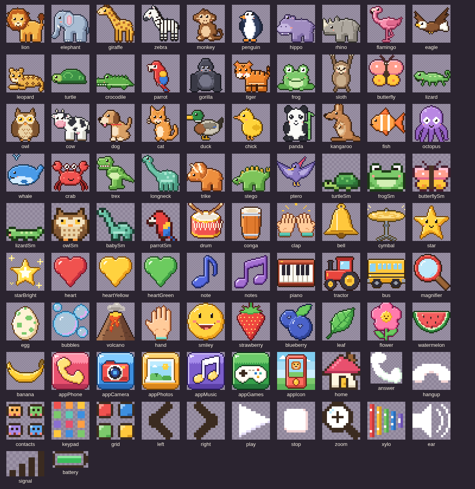

# KidPhone

**Play it:** https://deltasnull.github.io/KidPhone/

A pretend phone for a 1.5-year-old and a 3.5-year-old, made to run on Dad's iPhone in Safari under
Guided Access. It's one self-contained `index.html` (vanilla JS, no build step), drawn entirely in pixel art, with six apps:

- **Phone**: animal and dinosaur contacts, a keypad with real touch-tones, and outgoing calls (ringback, then the
  animal answers, makes its call and chats every ~6 seconds until hang-up). Animals also call in every
  1–3 minutes while the kids are on the home screen. It can never place a real call: there are no `tel:` links,
  and phone-number detection is turned off.
- **Camera**: a pretend safari camera, a pixel-art world (savanna, jungle, dino valley) that goes all the way round.
  **Move the phone to look around** (see [Look around](#look-around)): turn to see the rest of the world, tip the phone
  up for the sky and down for the ground. Dragging works too, and is all there is where the phone shares no motion.
  The shutter flashes, clicks and saves a small pixel-art PNG, and (if a parent turns it on) the voice says what's in
  the shot. Each scene has two hidden animals to find. 1×/2× zoom, and the last-photo thumbnail opens Photos.
  It also has **the phone's real camera** (see [The real camera](#the-real-camera)): photos with fun looks, and selfies in
  pixel-art animal costumes. A parent can switch it to pretend only.
- **Photos**: the kids' pictures, newest first. Big arrows and swipe, and (if a parent turns it on) the voice names the animals.
  A selfie in a costume makes that animal's sound when it comes up.
  Starts with 4 sample photos. Keeps the newest 60. There's no delete button for kids.
- **Music**: a pentatonic xylophone, drum pads, an animal piano (every key is an animal sound in tune), and
  4 songs with a dancing animal: Twinkle Twinkle, Old MacDonald, The Wheels on the Bus, If You're Happy and You Know It.
- **Games**: a controller icon that opens a game picker. Each card says who it's for: "1 player" with one little kid, or
  "1 or 2 players" with two (numbers are in the 8-bit digit font, so a 2 never reads as an 8). A game for 1 or 2 asks
  first, with two big buttons: one kid, or two kids. The last choice glows.
  - *Ball Trail* (1 player): steer a ball around two hedges into the star garden. Bumps stop the ball; no lives or timer.
  - *Star Flight* (1 player): steer a parrot to catch five drifting stars. Missed stars return; no penalty.
    Both start with touch-and-hold steering. A grown-up can tap **Use tilt**, allow motion on iPhone, and hold the
    phone comfortably for calibration. **Center tilt** resets that position; **Use touch** switches back.
    Rotation recalibrates automatically. If sensor updates stop, touch steering remains available. Each game has a
    clear ending and Play again. Existing pixel art and sound effects are used; there are no new spoken lines.
  - *Wild Tap Safari* (1 player): Safari, Zoo and Dino sound boards, Find It, egg hatching and bubble popping.
    Its grid button goes back to the Wild Tap menu.
  - *Snack Time* (1 player): a hungry animal walks in, thinking of a food in a thought bubble. Tap that food on the picnic
    blanket and it flies into the animal's mouth: munching, the animal's call, hearts and a sticker, then the next animal
    walks in. Two foods to choose from at first, three after a few animals. A wrong food only gets a gentle head shake, and
    after two tries the right food glows, so there's no way to lose. Every fifth animal is a little party. The bubble
    shows the food, so the game works with the voice off (with Animal names on, it also says "The panda wants some bamboo!").
    31 animals, each shuffled in once before any comes back: monkey and banana, penguin and fish, puppy and bone, panda and
    bamboo, giraffe and leaf, chick and corn, turtle and strawberry, parrot and blueberry, frog and fly, hippo and
    watermelon, cow and grass, lion and meat, tiger and meat, elephant and peanut, zebra and grass, rhino and apple,
    flamingo and shrimp, eagle and fish, gorilla and orange, butterfly and flower, kitty and milk, duck and peas, kangaroo
    and carrot, octopus and shrimp, lizard and fly, crocodile and fish, and the dinosaurs: T. rex and meat, long neck and
    leaf, triceratops and fern, stegosaurus and fern, pterodactyl and fish.
  - *Dino Buddies* (1 or 2 players): the split-screen game for both boys. Every tap on either half flies a treat into one
    shared egg. With 1 player, one big dino fills the screen and the egg needs fewer treats (16 instead of 24).
    The hatched family is remembered between visits.
  - *Paint Pals* (1 or 2 players): split screen again, with a coloring page of an animal on each half. Rubbing a finger over it
    paints it in its real colors, each half with its own notes on one shared scale, so two kids painting at once still
    sounds like music. Tapping beside the picture flings a blob of paint onto it, so the little one can tap instead of
    rub. When a picture is nearly painted it finishes itself and the animal calls out. When both are done, the two
    animals dance and call to each other, go up on the shelf in the middle (remembered between visits), and a new pair
    arrives: lion and giraffe, puppy and kitty, monkey and parrot, cow and chick, T. rex and long neck, and seven more.
    With 1 player, one big coloring page fills the screen and the same animals come one at a time.

- **School**: learning games, made for a home-school morning. Letters are drawn in a school-print pixel alphabet (circles
  and sticks, the way children learn to write them: one-story a and g, a crossed t, a tailed q), each letter always in
  its own color; numbers are drawn the same way. The School menu shows its seven games as picture cards (two across,
  four in landscape). A grid button in each game goes back to the School menu.
  - *ABC Zoo* (first in School): all 26 letters, little letters first. Tap one to see it little and big, with a word
    and picture for it; the picture makes its sound, then the voice says "L is for lion!" Tap the big letters to hear
    the letter again, or the picture for its word. A button switches the board to capitals and back, and the song
    button plays the ABC song (the Twinkle Twinkle tune) with each letter lighting up in time. Words: apple, butterfly,
    cat, dog, elephant, frog, gorilla, hippo, iguana, jellyfish, kangaroo, lion, monkey, note, octopus, penguin, queen,
    rhino, star, tiger, umbrella, volcano, whale, fox ("X is in fox!"), yo-yo, zebra.
  - *Letter Path*: the letters one at a time, a to z. A trail of 26 stepping stones, little letters first; the next one
    bounces with an owl beside it, and each one opens when the one before is done. A lesson is four short steps, shown
    as four dots at the top:
    1. *Meet*: the little letter big, its capital beside it, and its word: "This is a. A is for apple!" Tap the
       letters for its name, the picture for the word.
    2. *Trace*: the letter on writing lines. Follow the star along each stroke, in the order and direction children are
       taught to write it (round letters start at the top right and go counter-clockwise; b and p go down the stick, then
       back up and around). The ink only moves forward along the stroke, so a scribble can't skip ahead; left alone for a
       moment, a ghost star shows the way.
    3. *Hear*: "Which one starts with A?" Three pictures: the lesson's word, then a second word where there is one
       (alligator, bus, cow, duck, egg, fish, gift, hand, igloo, jam, kite, leaf, moon, nest, panda, rocket, sun,
       turtle, van, watermelon). Look-alike starts (p and b, m and n, the vowels; c, k and q) are never asked against
       each other. For x it's "Which one ends with X?" (fox, box).
    4. *Find*: "Which one is a?" Three letters, with ones learned before mixed in; c, k and q and mirror letters (b and
       d, p and q) are never side by side.
    A wrong tap is answered by name ("Van starts with V!", "That's t!") and asked again; after two tries the right
    one glows. A lesson ends with one to three stars (three for no wrong taps); the best is kept, and any lesson done
    can be done again.
    For now the lessons use letter names only: the letter sounds (each cut by the voice tool from the narrator saying a
    word, see [`tools/voices/`](tools/voices/README.md)) aren't right yet, so they're only on each letter's parent
    page, to check them.
  - *ABC Snack*: Snack Time with letter cookies. After the first "feed the animals" line, each animal just asks:
    "Puppy wants an S!" Its thought bubble shows an ear, never the letter, so the child has to know it (tap the bubble
    to hear it again). It grows with the child: big letters, then (after eight right on the first try in a row) mostly
    little letters ("Frog wants a little b!"); three misses in a row steps back. It always asks by the letter's name,
    never its sound (the letter sounds stay in the Letter Path's lessons). Letters come a few at a
    time, A to Z like the Letter Path (A to F first); a new group joins once most of the current ones are known. After
    the first few animals, now and then every cookie's letter is drawn in plain ink, so the child goes by the letter's
    shape rather than its color (Find in the Letter Path does the same in its last round). A wrong cookie is
    never a loss: a head shake, the voice names the cookie that was tapped ("That's N!") and asks again, and after two
    tries the right one glows. Look-alikes (b and d, p and q) stay apart until the child knows most letters. A right
    cookie gets a crunch and "Yum!"
  - *123 Zoo*: the numbers 1 to 10 in the same pixel print. Tap one and that many animals hop into a ten-frame (two
    rows of five, the way early math shows a number: seven is "five and two more"), each counted out loud ("One! Two!
    Three!"), then "Three zebras!" and they all call. One lion, two elephants, three zebras, four penguins, five frogs,
    six ducks, seven monkeys, eight butterflies, nine chicks, ten fish. Tap the frame to count again; the 10 button
    counts ten stars ("Count to ten!") and cheers.
  - *123 Snack*: an animal walks in thinking of a number: "Puppy wants three bones!" Under it, empty boxes (five, or
    ten once it asks for more than five), a basket of its food and a green check. Each tap on the basket drops one snack
    into the next box, counted out loud and numbered; tapping the boxes takes the last one back. The child taps the
    check when it's right: the animal eats them all ("Yum! Three bones!") and earns a sticker. Too few or too many is
    said gently ("Two is not enough!", "Four is too many!") and asked again; after two tries the boxes it wants glow.
    With the parent setting *Help count*, there are exactly as many boxes as it wants and it eats as soon as they're
    full (for a toddler, or to teach counting first). Up to three for the first three animals, then up to five, and up
    to ten after ten. Monkey and bananas, penguin and fish, puppy and bones, giraffe and
    leaves, turtle and strawberries, parrot and blueberries, frog and flies, elephant and peanuts, kangaroo and carrots,
    gorilla and oranges, rhino and apples.
  - *Dino Picnic*: a dinosaur wants a number of snacks ("T rex wants three drumsticks!", the number in its bubble).
    More snacks than it wants lie scattered on the picnic blanket; tap them onto its plate, where they land in a jumble
    (no boxes to read the number from), so the child counts the snacks themselves. Tap the plate to put the last one
    back, and the green check to feed it: "Yum! Three drumsticks!" Too few or too many is said gently, and after two
    tries rings on the plate show how many. One to three for the first three dinos, then up to five. T rex and
    drumsticks, long neck and leaves, triceratops and ferns, stegosaurus and strawberries, pterodactyl and fish. With
    *Help count* the rings are there from the start and the dino eats as soon as they're filled.
  - *Animal Delivery*: following directions. An animal brings something and the voice says where it goes: "Put the
    apple under the tree!" Drag it there (or tap a glowing spot). It starts with in the box or on the table, adds under
    the table after three right (on and under at the same table), then under the tree and next to the box after six;
    each time the game opens it starts over. In the box, the thing sits down inside, peeking over the rim (there's no
    "on the box": the box is open on top). A wrong spot is named ("That's on the table.") and the thing comes back; after two tries the right spot
    glows. Ten things to deliver: an apple, a banana, a present, a star, an egg, a duck, a chick, a kitty, a frog and a
    ball.
  - Parents get a page in settings: every Letter Path letter with its stars (tap one to hear its sound and lesson
    line, see its words and how to say the sound), In order or All open, and starting the path over; and ABC Snack's
    stage and the letters it has seen the child know, with a way to fix it at big letters, little letters or sounds.
## School roadmap and progress

Track the learning improvements in [School learning roadmap](SCHOOL_ROADMAP.md).
For a Codex/Claude handoff or a request to “continue,” read [HANDOFF.md](HANDOFF.md) and [AGENTS.md](AGENTS.md) before editing.
The checklist covers parental controls, School-only mode, separate child profiles, meaningful
learning progress, guided lessons, new activities, and verification.

| Phase | Planned work |
| --- | --- |
| 1 | Parent PIN, app restrictions, School-only mode, play time, School sounds (child profiles on hold) |
| 2 | Improvements to existing learning activities (skill tracking on hold) |
| 3 | Today's Adventure, Dino Picnic, Sound Safari, and Animal Delivery |
| 4 | Sorting, stories, patterns, feelings, and useful parent summaries |

Implementation status and completion evidence are maintained in the roadmap. Check off tasks
there as they are implemented and verified.

## Animal voices

Most animals are **real recordings** from [Wikimedia Commons](https://commons.wikimedia.org/), all public domain, CC0,
CC BY or CC BY-SA, credited in [`assets/sounds/CREDITS.md`](assets/sounds/CREDITS.md). Each is cut to its best call
and levelled by [`tools/sounds/`](tools/sounds/README.md). The dinosaurs, which nobody has recorded, are designed the
way film sound designers do it: real animals slowed down and layered. Animals with no good free recording keep a
synthesized call, and so does the copy with no sound files. Those are modeled on the real animals: a buzzing "vocal
cord" source shaped by throat and mouth resonances, with the real call's pitch swoops, growl and breath, under about
2 seconds, and the animal finishes its call before it talks.

**Made for the phone's own speaker.** A phone speaker plays almost nothing below 300 Hz, so a deep sound that's
loud on headphones can vanish on the phone (measured through a model of that speaker, the old dinosaur footsteps lost
33 dB, a real lion's roar 9 dB, a slowed-down T. rex 13 dB). Every sound, recorded or synthesized, is now judged the way
that speaker plays it: deep sounds carry their weight in the mids (a knock in a footstep, harmonics in a hum, less
bass and more presence in the roars), and every animal call is levelled to the same loudness on the phone, within
about 1 dB of each other, and never a blast on headphones. A soft limiter rounds off peaks, so nothing clips.

| Animal | Its call |
| --- | --- |
| Lion | a male lion roaring (recording) |
| Elephant | an elephant trumpeting (recording) |
| Giraffe | a soft "mmm" hum (giraffes really hum), then munching (synthesized) |
| Zebra | a horse's whinny (recording) |
| Monkey | a chimpanzee's pant-hoot building up into two screams (recording) |
| Penguin | an African penguin's bray, twice: haw haw (recording) |
| Hippo | a wheeze-honk: a squeaky in-breath, then rhythmic honks (synthesized) |
| T. rex | a lion's roar slowed down, an alligator's bellow under it and a low elephant trumpet (designed) |
| Long neck | a gentle "hoooom", then two big footsteps (synthesized) |
| Triceratops | two nose snorts and a grunt (synthesized) |
| Stegosaurus | an alligator's grunt, slowed down, then two footsteps (designed) |
| Pterodactyl | a red-tailed hawk's scream, a little slower and lower (recording) |

The camera scenes, Wild Tap and the games use the same sounds, plus recordings of a tiger's growl (also the leopard),
a macaw, a frog, an owl (sped up: a great horned owl hoots too deep for a phone speaker), a cow, a dog, a cat, a duck,
chicks (also the baby dinosaur) and a splash, and synthesized gorilla chest beats, a rhino's snort, a sloth and more.

## The voice

Everything the toy says is recorded ahead of time with natural-sounding neural voices (Kokoro, an open
text-to-speech model) rather than read out by the phone's built-in speech voice. A narrator does the prompts and
games, and every animal on the phone has its own voice:

| Who | Voice | Talking speed |
| --- | --- | --- |
| Narrator | American woman (`af_heart`) | 0.93 |
| Lion | American man (`am_michael`) | 0.92 |
| Elephant | British man (`bm_george`) | 0.9 |
| Giraffe | American woman (`af_bella`) | 0.94 |
| Zebra | American woman (`af_sarah`) | 1 |
| Monkey | American man (`am_puck`) | 1.06 |
| Penguin | British woman (`bf_emma`) | 1.03 |
| Hippo | American man (`am_echo`) | 0.94 |
| T. rex | American man (`am_onyx`) | 0.9 |
| Long neck | British man (`bm_fable`) | 0.88 |
| Triceratops | American woman (`af_kore`) | 0.98 |
| Stegosaurus | American woman (`af_aoede`) | 0.96 |
| Pterodactyl | American woman (`af_nova`) | 1.02 |

- **Calls** sound like calls: the animal's voice goes through a gentle phone-line filter, and the phone itself
  ("Calling Lion!", "Lion is calling you! Ring ring!") speaks in the narrator's voice.
- **Made for the phone's speaker**: a phone's own speaker plays almost nothing below 300 Hz, and some voices carry
  more down there than others, so every clip is voiced for it (a little less bass, a little more clarity around
  3 kHz) and levelled by how loud that speaker plays it: every character comes out at the same loudness, 3 dB over the
  animal calls. Clips play through the same sound engine as the animals, so they follow the volume setting and never
  cut them off.
- **Offline**: clips are small MP3s (`assets/voice/`, about 6 MB in all), fetched in the background after the first
  tap and kept by the offline cache.
- **Family names** (a contact you add) have no recording, so those lines use the phone's own voice when the silent
  switch setting is off, and are skipped when it's on (the phone's voice would silence the sound effects).

[`tools/voices/`](tools/voices/README.md) records them. It reads every line from `index.html`, so new lines get
recorded the next time it runs, and `npm test` fails if any line the toy can say has no recording.

**Your own recordings** (from the zoo, say) can replace any sound: drop them in `assets/sounds/` and list them in
`sounds.json`. See [`assets/sounds/README.md`](assets/sounds/README.md).

The big yellow home button is always in the same spot and always goes home. The talking voice speaks only where a parent
turns it on in settings (phone calls and Wild Tap's Find It to start with), every tap answers
on `pointerdown` with sound and motion, there are no failure states, and two kids can tap at once.


## Look around

The pretend camera follows the phone (settings: **Pretend camera: Move the phone / Drag only**, Move the phone by
default). Each world is a full circle: 3,200 world units is one turn, the right edge joins the left with no seam, and
more sky (deepening to blue overhead, with high clouds; in the jungle, more treetops) and more ground (pebbles and
tufts) carry on above and below for looking up and down.

- **How it maps**: turning the phone turns the scene by the same angle, and tipping it up or down looks up or down, up
  to 80 degrees. The picture spans about 85 degrees across, like a wide phone camera, so a full turn is about four
  screens. Held upright, the picture shows the horizon high up and the animals below it. The picture doesn't roll when
  the phone tilts sideways: pixel art never rotates.
- **Dragging still steers**: a drag adds a turn; a drag up or down drifts back to where the phone points.
- **Laid flat** (on a table or a lap), the phone goes back to plain dragging and the usual view, so a toddler doesn't
  just see the ground. Lifted again, it follows the phone from where the picture is.
- **Permission**: iPhone asks once before a website can use motion, and only as a finger lifts at the end of a tap
  (asking as it touches down, which is when the toy's buttons answer, gets a silent no). The toy only asks from a
  parent's tap in settings (choosing *Move the phone*, or *Done* while motion is still off), for the camera. The two tilt games have their own explicit **Use tilt** button, which a grown-up can tap before play.
  When the toy opens, Safari quietly reuses an earlier yes. The settings note says whether motion is working now; if
  Safari has forgotten (it may after it's closed), tap *Move the phone* again. In Guided Access, leave **Motion** on
  in its Options. Android phones share motion without asking.
- Taps on animals, hidden animals and photos all work across the join and while the phone moves.

## The real camera

On from the start alongside the pretend camera (settings: **Camera: Pretend / Real / Both**, Both by default; Pretend
turns it off). It's laid out like a phone camera, in the
toy's own pixel style: a big live picture, the shutter under it, and along the bottom the last photo, the modes and a
flip button. With **Both**, the modes are the pretend safari, Photo and Selfie; with **Real**, just Photo and Selfie.

- **Photo**: the back camera. 1×, 2× and 3× buttons sit on the bottom edge of the picture (the camera's own zoom where
  the phone offers it, otherwise the picture is enlarged). Swipe across the picture to change the look:
  Normal, Pixel, Comic, Rainbow, Mirror, Sunny, Ocean, Black and white, Upside down. A tap shows a focus square.
- **Selfie**: the front camera, shown as a mirror. A strip of round bubbles runs through the shutter ring, like the
  lens strip in Snapchat: slide it, tap a bubble, or swipe across the picture. The one in the ring is on. First come
  the costumes, pixel-art animal heads with a hole for the face: lion, T. rex, elephant (trunk hat and floppy ears),
  giraffe, monkey, zebra and stegosaurus. Each one makes its animal's sound when it goes on. Then the same looks as
  Photo mode.
- **The photo is what the kids saw**: the same code draws the live picture and the saved photo (look and costume
  included), at 640 pixels on the long side, saved as a JPEG.
- **Privacy**: photos stay on the phone, in Safari's storage for this page (IndexedDB), and never go anywhere. The site
  has no server. Clear photos (settings) deletes them, and so does clearing Safari's website data.
- **Only while it's on screen**: the camera runs only while the Camera app is open, and stops when the kids leave it,
  the phone locks or the toy goes to the background (the green camera dot goes away). It asks for pictures only, never
  the microphone: on an iPhone, using the microphone moves all sound to the earpiece.
- **Permission**: Safari asks the first time Photo or Selfie opens (the Camera starts on the pretend safari, so it
  doesn't ask until then). Choosing Real or Both in settings asks right then, so the question comes while a parent is
  holding the phone. To stop Safari asking again: tap the page menu (**aA**) next to the web
  address, then **Website Settings › Camera › Allow**. If the camera is refused or missing, the pretend camera shows
  instead, and settings say what happened and how to allow it.

## Pixel art

Every picture is pixel art placed one pixel at a time: no emoji, no vector drawings, no photos except your family's.

- **Sprites** live in `index.html` as text, in the `PIX` block: a palette, then one row of letters per row of pixels.
  Each letter is a color and `.` is see-through. Edit a row, reload, and the picture changes everywhere.
  There are 100: 37 animals and dinosaurs (32×32, facing left), 7 little 16×16 animals for far away in the camera,
  32 things and treats (Snack Time's foods and Paint Pals' brush among them), the 5 app icons, 18 buttons, checkmarks,
  player badges and status-bar icons, and the toy's own home-screen icon.
  `npm run sprites` draws them all on one sheet:

  

- **The camera world** is painted on a grid of 640×200 pixels (5 world units per pixel), sky and ground in flat
  bands with a little ordered dither where they meet, and joins round at its ends (the hills rise a whole number of
  times per lap, the clouds drift round, and props near the join are drawn on both sides). Trees, ponds, rocks, palms and the volcano are painted with the
  same tools as the sprites (shapes, then shading and an outline), and the scene is scaled up with hard edges. Animals are
  drawn at whole-number sizes and never rotated: they walk, hop and peek, and sway by shuffling one pixel.
- **Buttons, cards and backgrounds** are pixel pictures too, painted by the script on a 3-CSS-pixel grid: frames with
  notched corners for every button (CSS `border-image` stretches the middle), round pixel buttons, and a background for
  each screen painted to fit it and repainted when the screen changes size.
- **Fonts**: [Pixelify Sans](https://fonts.google.com/specimen/Pixelify+Sans) for words and
  [Press Start 2P](https://fonts.google.com/specimen/Press+Start+2P) for numbers (its 3, 5 and * are easy to tell apart).
- **Photos** are saved at one pixel per art pixel and shown scaled up with hard edges, so they stay sharp and small.

## Put it on the phone

1. **Put it online over HTTPS.** Pick one:
   - **GitHub Pages (public, easiest):** the workflow in `.github/workflows/deploy-pages.yml` publishes the toy
     whenever it changes on `main`, at **https://deltasnull.github.io/KidPhone/**. One-time setup in the repository on GitHub:
     **Settings → Pages → Build and deployment → Source: GitHub Actions**. On a free GitHub plan the repository must
     be public for Pages to work (Settings → General → Danger Zone → Change visibility). To publish by hand:
     Actions → *Deploy to GitHub Pages* → **Run workflow**. Only the toy is published: no tests, tools or
     `assets/family/`. Anyone with the link can open it, so family contacts don't work there.
   - **Your own server (private, needed for family contacts):** any static file server works (Caddy, nginx, a NAS
     web server). Upload `index.html`, `manifest.webmanifest`, `sw.js`, `icons/` and `assets/` (with
     `assets/family/` if you add family contacts).

   Every link in the page is relative, so it works at a domain's root or in a subfolder like `/KidPhone/`.
2. On the iPhone, open the URL in Safari, then **Share → Add to Home Screen**. Opened from that icon, it runs full screen
   with no Safari bars, and it keeps working offline once loaded (the service worker caches it).
3. **Guided Access**: Settings → Accessibility → Guided Access → on, and set a passcode. Open Toy Phone, then
   triple-click the side button to start. Triple-click and enter the passcode to leave.
4. **Silent switch**: with the parent setting *Sound when the phone is on silent* on (the default), the toy plays even
   when the ring/silent switch is set to silent. Turn it off to have the toy follow the switch like other web pages.

Home-screen apps keep their own storage, so photos taken there don't show up in Safari's copy, and the reverse.
Opened from the home screen, iOS lays the page out as if the status bar still took its own space, yet draws it from the
top of the screen, which would leave a status-bar-high strip empty at the bottom; the toy notices and fills the screen.

## Parent settings

Hold the clock in the top-left corner for **3 seconds**. If you have set a parent PIN, enter it to open settings. A quick tap only wiggles the clock.

### App access and parent PIN

- **School only:** launches directly into School; Home returns there. Phone, incoming calls, Games (including nested games), Camera, Photos, and Music are unavailable.
- **Custom:** choose which of the six apps are available. At least one must remain available. Disabled sections are hidden and blocked at navigation entry points.
- **Full phone:** all six apps are available, preserving the original experience.
- Choosing School only or Custom first asks you to create and confirm a **four-digit PIN**. You can also choose **Set PIN** while using Full phone. Later, **Change PIN** is available inside unlocked parent settings.
- Camera permissions and camera-look motion permissions are not requested while Camera is disabled. Games can separately request motion only when Games is allowed and **Use tilt** is tapped. Disabling Camera stops its stream; disabling Phone ends an active call.
- Access choices and the PIN digest are saved locally. Closing/reopening and offline use preserve them. Safari and the home-screen app can have separate storage, so configure each copy you use.
- Five incorrect PIN attempts cause a 30-second delay that survives reloading. Leaving settings, pressing Home, or backgrounding the app closes the parent session.
- The PIN is a child-facing settings gate, not device security. Continue using **Guided Access** to keep the child inside ToyPhone.

**Forgotten PIN:** there is no child-accessible bypass. If a parent has access to browser developer tools, removing only the local storage key `toyphone.access` resets the PIN and app policy while preserving other ToyPhone data. Otherwise, removing this site's browser/app website data resets the PIN **and also deletes locally stored progress and photos**. Recovery returns the app to Full phone; configure restrictions again before handing it over. The app cannot recover a forgotten PIN.

### Play time

- **Off** (the default), **15 min**, **30 min** or **1 hour**. When the time is up, the voice says "Almost time for a break!" and a little moon shows in the status bar; the child can finish what they're doing. The session ends as they leave it (or at a menu, or after two minutes): a sleepy owl under the moon covers the toy with "Time for a break! See you soon!" The home button doesn't get past it and no calls come in.
- Only a grown-up starts more play: hold the clock (and enter the PIN, if set), then **Start a new session**, a longer limit, or Off. The break screen stays until then, even if the toy is closed and opened again.
- Only time with the toy on screen counts (not settings, not the phone asleep), and each day starts fresh.

**Not planned for now:** child profiles and progress tracking are on hold while the toy is being tested. See [the roadmap](SCHOOL_ROADMAP.md) and [current handoff](HANDOFF.md).


**Getting ready**: when the toy opens and Safari still needs an OK for something it's set to use (motion for *Move the
phone*, the camera for Real or Both), a card asks a grown-up for one tap before handing it over: **Start** runs Safari's
questions one after another (tap Allow on each), **Not now** skips them. Safari only asks about motion during a tap, so
this is the one moment it can be asked without the kids seeing it. Nothing to ask (allowed before since Safari opened, or
turned off in settings): no card.

- Incoming calls on/off
- Volume (Quiet / Soft / Medium / Loud)
- Sound when the phone is on silent (on by default)
- **ABC Snack**: Grows (the default), or fixed at Big letters or Little letters, with the current stage and the
  letters the child knows (picked right by name on the first try three times)
- **123 Snack**: Count myself (the default: the child decides how many and taps the check) or Help count (the boxes
  show how many)
- **School sounds**: On (the default), Quieter or Off: animal sounds, crunches and cheers in the School games. The lesson
  voice always speaks, so a question the child has to listen to never goes silent
- **Letter Path**: In order (the default: each letter opens when the one before is done) or All open, every letter
  with its stars, and a page for each letter: its words, how to say its sound, *Hear the sound* and *Hear the words*.
  *Start the path over* clears the stars, with a confirm step
- **Camera**: Both (the default: the pretend safari plus the phone's camera), Real (the phone's camera only) or
  Pretend (no real camera), with a note on whether the camera is allowed and how to allow it
- **Pretend camera**: Move the phone (the default: the scenes follow the phone; tapping it is what lets Safari ask
  about motion) or Drag only, with a note on whether motion is working
- **Voice**: a checkbox for each place the talking voice can speak. Animal sounds and music always play (in School, as
  *School sounds* says). School and Wild Tap's Find It ask their questions out loud, so those two are always on.

  | Checkbox | What the voice says | Starts |
  | --- | --- | --- |
  | Phone calls | The animals talk when you call them and when they call you | on (a call is the animal talking) |
  | Wild Tap: Find It | "Where is the giraffe?" | always on (the game is the question) |
  | Opening apps | "Hi buddy!", "Phone! Who do you want to call?", "Tap the egg!" | off |
  | Animal names | The animal's name after its sound, Wild Tap facts, hatched babies, what each Snack Time animal wants, finished paintings | off |
  | Camera and Photos | The animals in view and in each picture | off |
  | School | Letters, sounds, words and counting in the School games | always on (the games ask out loud) |
  | Keypad numbers | Each number pressed | off |
  | Music | Instrument and song names | off |

- Clear photos, with a confirm step built into the page
- Ring now and Test sound, for checking the phone
- Whether the sound engine is running, whether the recorded voice loaded, and how many family contacts loaded

## Family contacts

Contacts with a real photo and recorded voice clips ("Hi buddy, it's Daddy!"). See
[`assets/family/README.md`](assets/family/README.md). That folder is git-ignored apart from its README and example,
so private voices and faces stay on your server.

## Check on the real iPhone

The automated test runs in Chromium, so these need a person and the phone:

- [ ] Sound plays on the very first tap
- [ ] The animal calls, drums and ringtones play, and keep playing after the voice talks
- [ ] With the ring/silent switch on silent, the animals and the voice still play (the setting is on by default)
- [ ] The voices sound right: the narrator, and each animal on a call (they were checked here by transcribing every
      clip with a speech recognizer, not by ear)
- [ ] The animal calls sound right on the phone's speaker. They were checked here with spectrograms, not by ear
- [ ] Guided Access session: nothing leads out of the page
- [ ] Portrait and landscape
- [ ] Two kids tapping at once
- [ ] Ball Trail and Star Flight: allow and deny Use tilt on a real iPhone; center in a comfortable grip, rotate both ways, lock/unlock, and switch to touch. Try with Camera disabled and Games allowed, and with Guided Access Motion enabled. Confirm the children can steer comfortably.
- [ ] The real camera (settings: Camera: Both): Safari's question comes when you pick it, Allow sticks, the back and
      front cameras show, the costumes line up with a face at arm's length, photos save and survive a reload, and the
      animal sounds keep playing while the camera is on
- [ ] The camera turns off (the green dot goes away) when you go home, lock the phone or switch apps
- [ ] Look around (settings: Pretend camera: Move the phone; Safari asks, tap Allow): turning and tipping the phone
      moves the scenes the same way, a full turn comes back round, laying the phone flat goes back to dragging, and it
      still works in Guided Access with Motion on. Then close Safari, open the toy again and see whether it still moves
      without asking (the settings note says)
- [ ] The letter names in School sound right ("Puppy wants an S!", "That's Q!", "A is for apple!"). The voice model is given
      each letter's name as exact phonemes (respelling made "A" sound like "eye"), and a speech recognizer heard them,
      but listen once
- [ ] The 26 letter sounds (settings, Letter Path, tap a letter, *Hear the sound*): each is cut from a word and was
      checked by measurement and on a spectrogram, never by ear. Hisses (s, f) should be a clean hiss, puffs (p, t, k,
      h) short with no "uh", held sounds (m, n, l, r, v, z) steady
- [ ] Tracing on the phone: the star follows a finger along each stroke, and a scribble doesn't count
- [ ] Play time (settings: 15 min): when it's up, the moon shows and the voice gives the heads-up; leaving the game
      brings the sleepy owl; the clock hold (and PIN) gets a grown-up to *Start a new session*
- [ ] School sounds Off: the School games are quiet except the voice, and the other apps still make their sounds
- [ ] 123 Snack, Count myself: adding, taking back and the green check feel right for the 3-year-old; Help count for the toddler
- [ ] Listen to *If You're Happy and You Know It*. Its melody was written from memory, so check it by ear
      (notes live in the `SONGS` list in `index.html`)

## Files

| Path | What it is |
| --- | --- |
| `index.html` | The whole toy (HTML, CSS and JS in one file) |
| `manifest.webmanifest`, `icons/` | Add to Home Screen name and icons (PNGs made from the `appIcon` sprite) |
| `sw.js` | Offline cache: network first, so updates show up on the next launch |
| `assets/family/` | Private family contacts (see its README) |
| `assets/sounds/` | Optional real animal recordings (see its README) |
| `assets/voice/` | The recorded voice: one MP3 per line, and `voice.json` listing them |
| `tools/voices/` | Records the voice (see its README) |
| `tests/smoke.cjs` | Playwright smoke test |
| `tests/pages.cjs` | GitHub Pages check: builds the site like the workflow, serves it under `/KidPhone/` and opens it as an iPhone and an Android phone |
| `.github/workflows/deploy-pages.yml` | Publishes the toy to GitHub Pages |
| `tools/make-icons.cjs` | Makes the home-screen icon PNGs from the `appIcon` sprite |
| `tools/sprite-sheet.cjs` | Draws every sprite on one sheet (`screenshots/sprites.png`) |
| `tools/make-artifact.cjs` | Builds the claude.ai artifact version (no PWA bits) |

## Develop and test

```sh
npm install        # Playwright + the two pixel fonts for offline test rendering
npm test           # iPhone portrait 390×844, landscape 844×390, and 390×664 (Safari with bars)
npm run test:motion # motion permission, steering, complete rounds and cleanup in three layouts
npm run test:motion:webkit # the same motion checks in WebKit
npm run test:parents # parent PIN, restrictions, camera/call shutdown, and offline persistence
npm run test:parents:webkit # the same policy checks in WebKit (live camera tested in Chromium)
npm run test:pages # the published site, served from a /KidPhone/ subfolder like GitHub Pages
npm run sprites    # draws every sprite on screenshots/sprites.png
npm run icons      # after editing the appIcon sprite
npm run artifact   # writes dist/artifact.html
```

The test taps every button on every screen, places and hangs up calls, takes photos, plays every instrument and a song,
plays every Wild Tap screen, hatches a Dino Buddies egg with two fingers at once, feeds Snack Time animals (wrong food
first), paints both Paint Pals pictures with two fingers at once until the pair goes up on the shelf, plays Dino Buddies
and Paint Pals again as 1 player, opens parent settings
with a 3-second hold, mashes 250 random touches (some two-handed), then checks the home button still gets home. It also
renders all 24 animal calls offline to check each is audible, under 2.5 seconds and not clipping, and it fails on any
console error. It also turns on the real camera, with Chromium's fake camera standing in, and checks both cameras,
zoom, looks, the costume strip, saved photos, that the camera stops off screen and that a refused camera falls back
to the pretend one. Orientation readings stand in for a moving phone: the pretend camera has to follow a 45 degree
turn exactly, come back round after a full turn, look up into the sky, go back to dragging when laid flat, and stop
following with Drag only; a stand-in for Safari's motion question grants it only during a finished tap, as an iPhone
does. Screenshots go to `tests/screenshots/`.

## Notes

- Pretend photos are stored in `localStorage` as small pixel-art PNGs (a few KB each, one pixel per art pixel); real camera
  photos are JPEGs (about 50 KB) in IndexedDB. If the phone runs out of room, the oldest photo is dropped first. Clearing Safari's website data deletes them. The sample photos from an older version are swapped
  for pixel ones the first time this version runs; photos the kids took are kept.
- **Sound on iPhone.** The phone's built-in speech voice and Safari's `playback` audio session (which plays through the
  silent switch) don't mix: each spoken sentence takes the speaker away from the sound effects and Safari never gives
  it back. That's why the voice is recorded clips played by the toy's own sound engine. With the silent-switch setting
  on, the session is `playback` and the built-in speech voice is never used. With it off, the session is `ambient`
  (everything follows the switch) and the speech voice may fill in for a family name. If iOS pauses the sound engine
  anyway (a phone call, Siri), sounds asked for meanwhile are held and play on the next touch, and an engine that won't
  restart is replaced. The voice waits for a sound to finish rather than talking over it.
- A call nobody hangs up says goodbye by itself after 3 minutes (`CALL_MAX_MS`), so a forgotten phone doesn't chat all afternoon.
- In portrait, the 8 xylophone bars and 8 piano keys are about 66px tall but span the full width, the ABC Zoo
  letters are about 53px (43px on a small iPhone with Safari's bars, where they go seven to a row so the big letter and
  its picture still fit above them), the 123 Zoo numbers about 65px, and the Letter Path stones about 68px (47px with Safari's bars showing; 26 share the screen, so the whole path shows
  without scrolling). Every other kid control is 80px or more.
- With five app icons, the three animals on the home-screen hill only show on tall portrait screens (800px or more).
- Every picture is a pixel sprite in `index.html`, so the toy looks the same on every phone, and walking animals always face the way they walk. The test fails if an emoji or an SVG sneaks back in, or if a sprite has uneven rows or a letter with no color.
- The real camera needs the toy's own https address (GitHub Pages or your own server). Anywhere it can't reach a camera
  (the claude.ai preview, a plain `file://` copy), the pretend camera shows instead.
