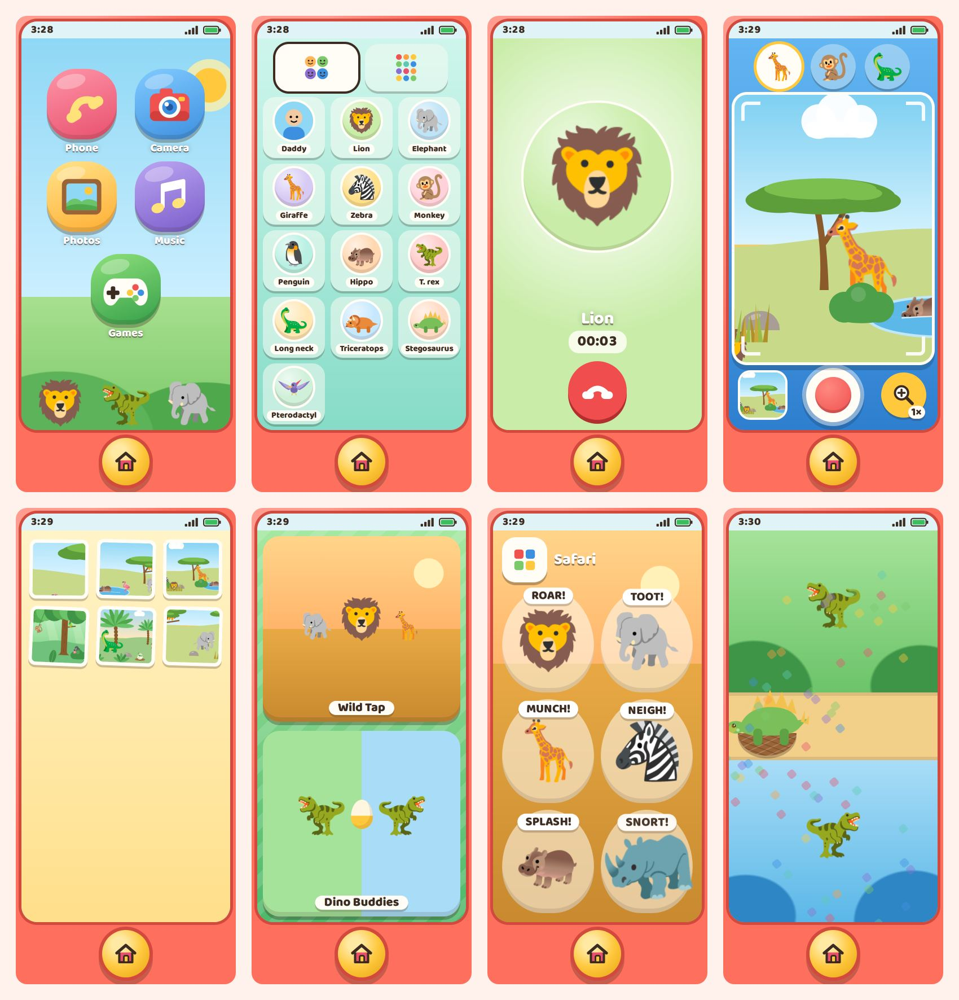
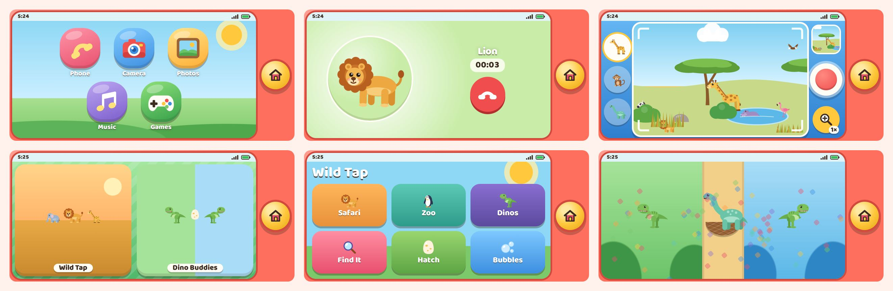

# Toy Phone

A pretend phone for a 1.5-year-old and a 3.5-year-old, made to run on Dad's iPhone in Safari under
Guided Access. It's one self-contained `index.html` (vanilla JS, no build step) with five apps:

- **Phone**: animal and dinosaur contacts, a keypad with real touch-tones, and outgoing calls (ringback, then the
  animal answers, makes its call and chats every ~6 seconds until hang-up). Animals also call in every
  1–3 minutes while the kids are on the home screen. It can never place a real call: there are no `tel:` links,
  and phone-number detection is turned off.
- **Camera**: a pretend safari camera. Drag to look around a drawn panorama (savanna, jungle, dino valley) about
  3 screens wide. The shutter flashes, clicks and saves a small JPEG, and the voice says what's in the shot.
  Each scene has two hidden animals to find. 1×/2× zoom, and the last-photo thumbnail opens Photos.
- **Photos**: the kids' pictures, newest first. Big arrows and swipe, and the voice names the animals.
  Starts with 4 sample photos. Keeps the newest 40. There's no delete button for kids.
- **Music**: a pentatonic xylophone, drum pads, an animal piano (every key is an animal sound in tune), and
  4 songs with a dancing animal: Twinkle Twinkle, Old MacDonald, The Wheels on the Bus, If You're Happy and You Know It.
- **Games**: a controller icon that opens a game picker with the first two games, moved in whole:
  - *Wild Tap Safari*: Safari, Zoo and Dino sound boards, Find It, egg hatching and bubble popping.
    Its grid button goes back to the Wild Tap menu.
  - *Dino Buddies*: the split-screen game for both boys. Every tap on either half flies a treat into one shared egg.
    The hatched family is remembered between visits.

## Animal voices

The animals' calls are modeled on the real animals: a buzzing "vocal cord" source shaped by throat and mouth
resonances, with the real call's pitch swoops, growl (roughness) and breath. Each stays under about 2 seconds and
mid-volume, and the animal finishes its call before it talks.

| Animal | Its call |
| --- | --- |
| Lion | a deep, rough, rising-and-falling roar, then two grunts |
| Elephant | a bright, brassy, wobbly trumpet |
| Giraffe | a low, soft hum (giraffes really hum), then munching |
| Zebra | a whinny: a high trilling squeal sliding down, then a soft nicker |
| Monkey | a chimp pant-hoot: hoots that speed up and climb, then excited screams |
| Penguin | an African penguin's donkey-like bray, "haa haa hee-haaaw" |
| Hippo | a wheeze-honk: a squeaky in-breath, then deep rhythmic honks |
| T. rex | a deeper, growlier roar with a soft rumble under it |
| Long neck | a low, gentle "hoooom", then two big footsteps |
| Triceratops | two nose snorts and a grunt |
| Stegosaurus | a rumbly grunt, a tail swish and a thump |
| Pterodactyl | a raspy, hawk-like "keee-ahh" |

The camera scenes and Wild Tap use the same voices (plus a leopard and tiger growl, parrot squawk, flamingo honk,
gorilla chest beats, frog ribbit, owl hoot and more).

**Real recordings:** a synthesizer only gets so close. To use real recordings (for example, ones you make at the zoo),
drop them in `assets/sounds/` and list them in `sounds.json`. See [`assets/sounds/README.md`](assets/sounds/README.md).

The big yellow home button is always in the same spot and always goes home. Every prompt is spoken, every tap answers
on `pointerdown` with sound and motion, there are no failure states, and two kids can tap at once.




## Put it on the phone

1. **Host the folder over HTTPS** on your own server (recommended). Any static file server works: Caddy, nginx,
   a NAS web server. Upload everything in this folder, including `assets/family/` if you add family contacts.
   A public static host (GitHub Pages) is fine for this version, but never put the family clips and photos there.
2. On the iPhone, open the URL in Safari, then **Share → Add to Home Screen**. Opened from that icon, it runs full screen
   with no Safari bars, and it keeps working offline once loaded (the service worker caches it).
3. **Guided Access**: Settings → Accessibility → Guided Access → on, and set a passcode. Open Toy Phone, then
   triple-click the side button to start. Triple-click and enter the passcode to leave.
4. **Nicer voice**: Settings → Accessibility → Read & Speak → Voices → English (on iOS 18 and earlier it's
   *Spoken Content* instead of *Read & Speak*). Download an *Enhanced* or *Premium* voice, such as Samantha (Enhanced),
   then reload the page. The page prefers a downloaded Enhanced or Premium voice, and the parent settings panel shows
   which voice it's using. If it still says the basic Samantha, Safari isn't offering the downloaded voice to web pages.

Home-screen apps keep their own storage, so photos taken there don't show up in Safari's copy, and the reverse.

## Parent settings

Hold the clock in the top-left corner for **3 seconds**. A quick tap only wiggles it, so toddlers won't get in by accident.

- Incoming calls on/off
- Volume (Quiet / Soft / Medium / Loud)
- Clear photos, with a confirm step built into the page
- Ring now and Test sound, for checking the phone
- Which speech voice is in use, and how many family contacts loaded

## Family contacts

Contacts with a real photo and recorded voice clips ("Hi buddy, it's Daddy!"). See
[`assets/family/README.md`](assets/family/README.md). That folder is git-ignored apart from its README and example,
so private voices and faces stay on your server.

## Check on the real iPhone

The automated test runs in Chromium, so these need a person and the phone:

- [ ] Sound plays on the very first tap
- [ ] Sound plays with the ring/silent switch set to silent (the page asks for `navigator.audioSession.type = 'playback'`)
- [ ] The speech voice sounds right (Enhanced voice downloaded?)
- [ ] The animal calls sound right on the phone's speaker. They were checked here with spectrograms, not by ear
- [ ] Guided Access session: nothing leads out of the page
- [ ] Portrait and landscape
- [ ] Two kids tapping at once
- [ ] Listen to *If You're Happy and You Know It*. Its melody was written from memory, so check it by ear
      (notes live in the `SONGS` list in `index.html`)

## Files

| Path | What it is |
| --- | --- |
| `index.html` | The whole toy (HTML, CSS and JS in one file) |
| `manifest.webmanifest`, `icons/` | Add to Home Screen name and icons |
| `sw.js` | Offline cache: network first, so updates show up on the next launch |
| `assets/family/` | Private family contacts (see its README) |
| `assets/sounds/` | Optional real animal recordings (see its README) |
| `tests/smoke.cjs` | Playwright smoke test |
| `tools/make-icons.cjs` | Renders `icons/icon.svg` to PNGs |
| `tools/make-artifact.cjs` | Builds the claude.ai artifact version (no PWA bits) |

## Develop and test

```sh
npm install        # Playwright + the Baloo 2 font for offline test rendering
npm test           # iPhone portrait 390×844, landscape 844×390, and 390×664 (Safari with bars)
npm run icons      # after editing icons/icon.svg
npm run artifact   # writes dist/artifact.html
```

The test taps every button on every screen, places and hangs up calls, takes photos, plays every instrument and a song,
plays every Wild Tap screen, hatches a Dino Buddies egg with two fingers at once, opens parent settings with a
3-second hold, mashes 250 random touches (some two-handed), then checks the home button still gets home. It also
renders all 21 animal calls offline to check each is audible, under 2.5 seconds and not clipping, and it fails on any
console error. Screenshots go to `tests/screenshots/`.

## Notes

- Photos are stored in `localStorage` as ~640px JPEGs (about 15–60 KB each). If the phone runs out of room, the oldest
  photo is dropped first. Clearing Safari's website data deletes them.
- A call nobody hangs up says goodbye by itself after 3 minutes (`CALL_MAX_MS`), so a forgotten phone doesn't chat all afternoon.
- In portrait, the 8 xylophone bars and 8 piano keys are about 66px tall but span the full width. Every other kid control is 80px or more.
- With five app icons, the three animals on the home-screen hill only show on tall portrait screens (800px or more).
- Screenshots come from Linux Chromium (Noto emoji). On the iPhone you'll see Apple's emoji.
- Camera and microphone ideas (selfie stickers, talk-back calls) need this self-hosted HTTPS setup. claude.ai artifacts block both.
